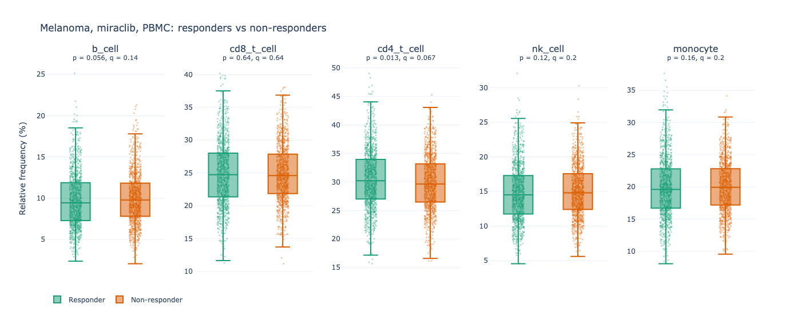

# Miraclib trial — cell counts

Loads `cell-count.csv` into SQLite, runs frequency and responder analyses, and serves a Streamlit app.

**Dashboard:** _(paste Streamlit URL after deploy)_ · locally: `make dashboard` → port 8501

## How to run

In Codespaces (or any Linux box with Python 3.9+):

```bash
make setup
make pipeline
make dashboard
```

`python load_data.py` alone builds `cell_counts.db` in this directory (no pip deps).

## Makefile

- **setup** — `pip install -r requirements.txt`
- **pipeline** — load CSV, then `run_pipeline.py` → `outputs/`
- **dashboard** — Streamlit on port 8501

## Files

| Path | Role |
|---|---|
| `schema.sql` | tables + `sample_population_frequencies` view |
| `load_data.py` | CSV → db |
| `run_pipeline.py` | Parts 2–4 outputs |
| `analysis/` | SQL + stats (shared with dashboard) |
| `dashboard/app.py` | interactive views |

CSV uses `condition` and `sex` (not indication/gender). Response is blank for healthy controls (stored as NULL).

## Key outputs

- `outputs/frequency_summary.csv` — sample, total_count, population, count, percentage  
- `outputs/responder_stats.csv`, `responder_boxplot.html`  
- `outputs/baseline_*.csv`, `outputs/summary.md`

## Findings (melanoma / miraclib / PBMC)

Cohort: 1968 PBMC samples, 656 subjects (3 visits each).



Mann-Whitney on % frequency; Benjamini–Hochberg q across five cell types:

| population | median diff (pp) | p | q |
|---|---|---|---|
| b_cell | −0.36 | 0.056 | 0.139 |
| cd8_t_cell | +0.12 | 0.639 | 0.639 |
| cd4_t_cell | +0.56 | 0.013 | 0.067 |
| nk_cell | −0.29 | 0.121 | 0.202 |
| monocyte | −0.33 | 0.163 | 0.204 |

**cd4_t_cell** is the only type with p < 0.05; q = 0.067 at α = 0.05. Mixed model (responder + day, random subject) still points at CD4 (+0.64 pp, q = 0.025) — details in `responder_stats_mixed_model.csv` and the dashboard.

**Baseline subset** (melanoma, miraclib, PBMC, day 0): 656 samples — prj1 384, prj3 272; 331 responder / 325 non-responder subjects; 344 male / 312 female. prj2 is whole blood only.

**Mean B cells** (melanoma, male, responder, day 0, all sample types and treatments): **10206.15** (n = 485).

## Dashboard deploy

Push to GitHub → [share.streamlit.io](https://share.streamlit.io) → main file `dashboard/app.py`, Python **3.11**. Update the Dashboard line above with the public URL.
